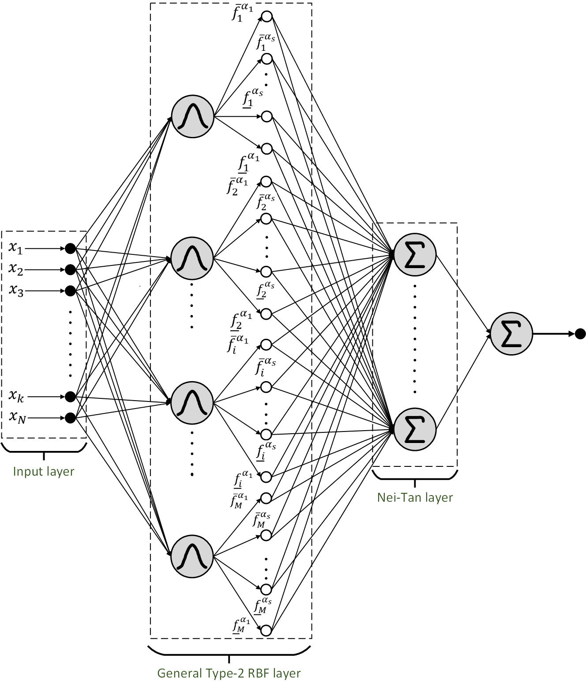
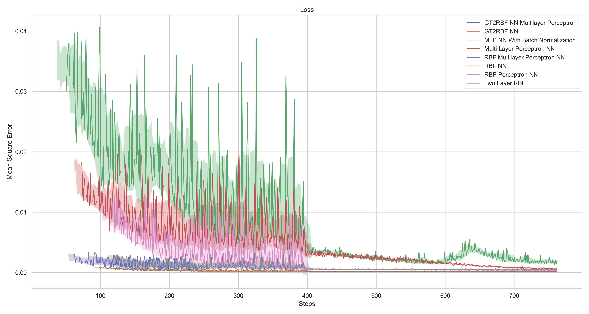
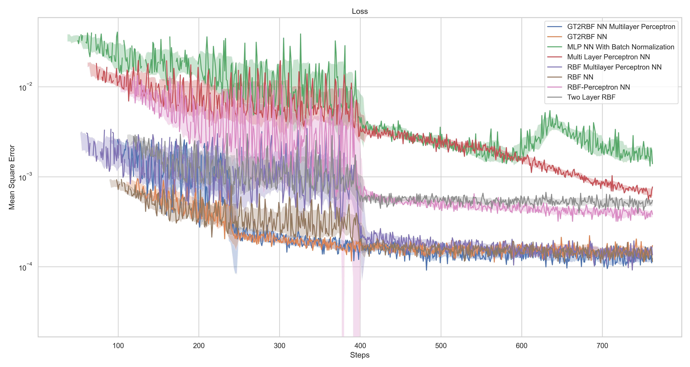
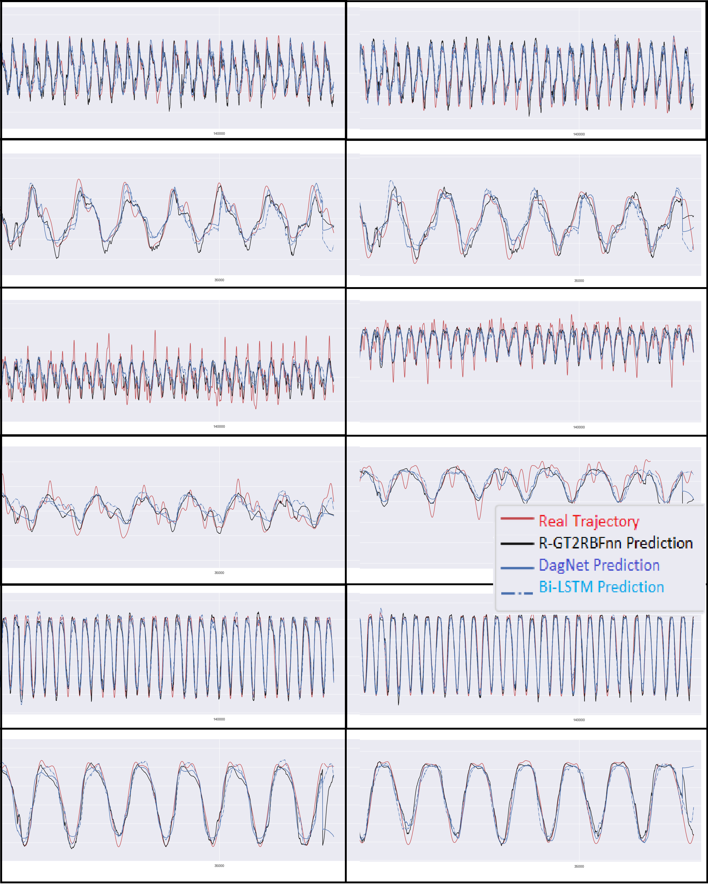

# EMG-Based Trajectory Prediction

This repository provides the implementation of the paper:

**Title**: *Recursive Generalized Type-2 Fuzzy Radial Basis Function Neural Networks for Joint Position Estimation and Adaptive EMG-Based Impedance Control of Lower Limb Exoskeletons*

**DOI**: [10.1016/j.bspc.2024.106791](https://doi.org/10.1016/j.bspc.2024.106791)

---

## Overview

This work focuses on the development of a **generalized type-2 fuzzy radial basis function neural network (GT2RBFnn)** for **joint position estimation** and **adaptive EMG-based impedance control** of lower limb exoskeletons. The repository contains the full implementation of the proposed GT2RBFnn method, which aims to improve the efficiency and accuracy of exoskeleton control by using **Electromyographic (EMG)** signals.

---

## Methodology

### GT2RBFnn Model
The core of this method is the **GT2RBFnn** which combines type-2 fuzzy logic systems with radial basis function networks. This approach helps to enhance the system’s robustness and flexibility and provide cost-efficiency.

### Loss Function Comparison
We compare different loss functions to evaluate the performance and convergence of the model during training.

---

## Visualizations

### GT2RBFnn Architecture
The diagram below illustrates the proposed **GT2RBFnn** method and its components:




### Loss Function Comparison

The following images show a comparison of the loss curves during training:

- **Loss Comparison**:

  

- **Logarithmic Loss Comparison**:

  

### EMG-Based Trajectory Estimation

Here are some example predictions of joint position estimation using **EMG signals**:



---


If you use this work in your research, please cite the following paper:

```bash

@article{AQABAKEE2025106791,
title = {Recursive generalized type-2 fuzzy radial basis function neural networks for joint position estimation and adaptive EMG-based impedance control of lower limb exoskeletons},
journal = {Biomedical Signal Processing and Control},
volume = {100},
pages = {106791},
year = {2025},
issn = {1746-8094},
doi = {https://doi.org/10.1016/j.bspc.2024.106791},
url = {https://www.sciencedirect.com/science/article/pii/S1746809424008498},
author = {Kianoush Aqabakee and Farzaneh Abdollahi and Afshin Taghvaeipour and Mohammad-R Akbarzadeh-T},
keywords = {Generalized type-2 radial basis function neural network, Recursive neural networks, Joint position prediction, Assistive lower limb exoskeletons, Adaptive Impedance Controller},
}
